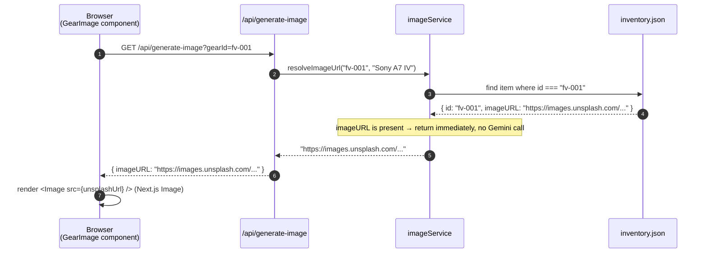
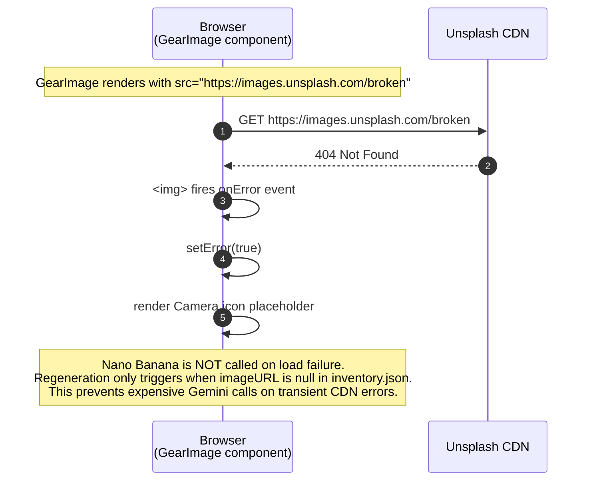

# Image Resolution Flow

This document explains how Rent my Gear resolves product images, from the initial inventory lookup through AI generation and optional GCS persistence.

---

## Overview

Every gear item has an optional `imageURL` field in `inventory.json`. When the field is `null`, the image is generated on demand by the Gemini API (called "Nano Banana" in the codebase) and returned to the browser as a base64 data URL. If Google Cloud Storage is configured, the generated image is uploaded and a public CDN URL is persisted back to `inventory.json` so future requests skip regeneration entirely.

---

## Sequence Diagram — Full Resolution Flow

```mermaid
sequenceDiagram
    autonumber

    participant Browser as Browser<br/>(GearImage component)
    participant API as /api/generate-image
    participant IS as imageService
    participant JSON as inventory.json
    participant Gemini as Gemini API<br/>(Nano Banana)
    participant SS as storageService
    participant GCS as Google Cloud Storage

    Browser->>API: GET /api/generate-image?gearId=da-011

    API->>IS: resolveImageUrl("da-011", "Garmin Descent Mk3i")

    IS->>JSON: find item where id === "da-011"
    JSON-->>IS: { id: "da-011", imageURL: null }

    note over IS: imageURL is null → must generate

    IS->>Gemini: POST /v1beta/models/gemini-2.0-flash-preview-image-generation:generateContent<br/>{ contents: [{ parts: [{ text: "Professional product photography of ..." }] }],<br/>  generationConfig: { responseModalities: ["IMAGE", "TEXT"] } }

    Gemini-->>IS: { candidates[0].content.parts[0].inlineData:<br/>  { data: "<base64>", mimeType: "image/webp" } }

    IS->>IS: build dataUrl = "data:image/webp;base64,<base64>"

    alt GCS not configured (Option B — current default)
        IS->>JSON: persistImageUrl() → skipped (data URLs not persisted)
        IS-->>API: dataUrl
        API-->>Browser: { imageURL: "data:image/webp;base64,..." }
        Browser->>Browser: setImgSrc(dataUrl) → render 
    else GCS configured (Option A — production upgrade)
        IS->>SS: uploadBase64Image(base64, "gear/da-011.webp")
        SS->>GCS: bucket.file("gear/da-011.webp").save(buffer, { public: true })
        GCS-->>SS: upload complete
        SS-->>IS: "https://storage.googleapis.com/<bucket>/gear/da-011.webp"
        IS->>JSON: persistImageUrl("da-011", publicURL) → writes inventory.json
        IS-->>API: publicURL
        API-->>Browser: { imageURL: "https://storage.googleapis.com/..." }
        Browser->>Browser: render <Image src={publicURL} /> (Next.js Image)
    end
```

---

## Sequence Diagram — Cache Hit (imageURL already present)



---

## Sequence Diagram — Image Load Failure (Unsplash 404)



---

## Component Responsibilities

### `GearImage.tsx` (client component)

Decides how to render based on `src` prop:

```
src prop value
├── truthy string
│   ├── starts with "data:"  → plain  (Next.js Image rejects data URLs)
│   └── http(s) URL          → <Image fill sizes="..." /> (Next.js optimized)
│       └── onError fires    → setError(true) → Camera placeholder
└── null / undefined
    └── useEffect triggers   → GET /api/generate-image?gearId=<id>
        ├── pending          → animated skeleton with "Generando imagen…" text
        ├── success          → setImgSrc(imageURL) → re-render with image
        └── failure / no URL → setError(true) → Camera placeholder
```

### `imageService.ts` (server-side)

```typescript
export async function resolveImageUrl(gearId: string, gearName: string): Promise<string> {
  const item = inventoryData.find((i) => i.id === gearId);

  if (item?.imageURL) return item.imageURL;           // 1. cache hit

  const dataUrl = await generateImageWithGemini(gearName); // 2. generate
  persistImageUrl(gearId, dataUrl);                        // 3. persist (no-op for data URLs)
  return dataUrl;
}
```

### `storageService.ts` (server-side, optional)

Used only when GCS environment variables are set. `uploadBase64Image` converts the base64 string to a `Buffer`, saves it to the bucket with `public: true`, and returns the canonical GCS URL.

---

## Prompt Used for Image Generation

```
Professional product photography of {gearName} on a clean white background.
High resolution, sharp focus, studio lighting, commercial quality.
```

The prompt is intentionally minimal and consistent to produce clean product-style images.

---

## Why Data URLs Are Not Persisted

`persistImageUrl` skips writing when `imageURL.startsWith("data:")`:

```typescript
function persistImageUrl(gearId: string, imageURL: string): void {
  if (imageURL.startsWith("data:")) return;  // ← guard
  // ...write to inventory.json
}
```

A single WebP image encoded as base64 can exceed 200 KB as a string. Writing that into `inventory.json` would bloat the file, slow every inventory load, and break the Zod URL validator (`.url()` rejects data URLs). The correct upgrade path is GCS: upload the image, persist the public HTTPS URL instead.

---

## Enabling GCS (Option A)

Add three variables to `.env.local`:

```env
GCS_BUCKET_NAME=your-bucket-name
GCS_PROJECT_ID=your-gcp-project-id
GOOGLE_APPLICATION_CREDENTIALS=/absolute/path/to/service-account.json
```

Then run the setup script:

```bash
cd scripts
uv run setup_gcs.py
```

The script creates the bucket, sets `allUsers/storage.objectViewer` for public access, and runs a smoke test (upload → verify URL → delete). Once configured, `imageService` will automatically use GCS instead of returning data URLs.
