# Services — Class Diagram & Reference

This document covers `inventoryService`, `imageService`, and `storageService`: their public APIs, internal mechanics, and how they interact with each other and with external systems.

---

## Class Diagram

```mermaid
classDiagram
    direction TB

    class inventoryService {
        -GearItem[] _cache
        -number _cacheTime
        -number CACHE_TTL_MS = 300000
        +getAllGear() GearItem[]
        +getGearByCategory(category Category) GearItem[]
        +getGearById(id string) GearItem | undefined
        +getRandomGear(count number) GearItem[]
        +searchGear(query string, category? Category) GearItem[]
        +resetCache() void
    }

    class imageService {
        -string NANO_BANANA_API_KEY
        -string INVENTORY_PATH
        +resolveImageUrl(gearId string, gearName string) Promise~string~
        -generateImageWithGemini(gearName string) Promise~string~
        -persistImageUrl(gearId string, imageURL string) void
    }

    class storageService {
        -Storage _storage
        -requireGcsEnv() RequiredEnv
        -getStorage() Storage
        +uploadBase64Image(base64Data string, fileName string, contentType? string) Promise~string~
        +fileExists(fileName string) Promise~boolean~
        +deleteFile(fileName string) Promise~void~
    }

    class GearItem {
        <<type>>
        +string id
        +string name
        +Category category
        +string description
        +number dailyRate
        +string | null | undefined imageURL
        +Record~string_string~ specs
        +boolean available
    }

    class Category {
        <<enumeration>>
        fotografia-video
        montana-camping
        deportes-acuaticos
    }

    class PriceBreakdown {
        <<type>>
        +number days
        +number dailyRate
        +number subtotal
        +number tax
        +number total
    }

    class dateUtils {
        <<module>>
        +calculateDays(range DateRange) number
        +calculatePrice(dailyRate number, range DateRange) PriceBreakdown
        +formatDateEs(date Date) string
        +formatCurrency(amount number) string
        +isAvailableDate(date Date) boolean
        +isValidRange(start Date, end Date) boolean
    }

    class inventoryJSON {
        <<data source>>
        +GearItem[] items
        +path: src/data/inventory.json
    }

    class GeminiAPI {
        <<external service>>
        +generateContent(body GeminiRequest) GeminiResponse
        +endpoint: /v1beta/models/gemini-2.0-flash-preview-image-generation
    }

    class GoogleCloudStorage {
        <<external service>>
        +bucket(name string) Bucket
        +Bucket.file(name string) File
        +File.save(buffer Buffer, opts SaveOptions) Promise~void~
        +File.exists() Promise~boolean[]~
        +File.delete() Promise~void~
    }

    class envConfig {
        <<module>>
        +getEnv() EnvVars
        -EnvVars _env
    }

    %% Relationships
    inventoryService --> GearItem : produces
    inventoryService --> Category : filters by
    inventoryService --> inventoryJSON : reads (with cache)

    imageService --> inventoryJSON : reads (direct, bypasses cache)
    imageService --> inventoryJSON : writes (persists URL)
    imageService --> GeminiAPI : calls when imageURL is null
    imageService ..> storageService : uses (optional, GCS path)

    storageService --> GoogleCloudStorage : wraps
    storageService --> envConfig : reads GCS vars

    dateUtils --> PriceBreakdown : returns

    inventoryService --> envConfig : reads NANO_BANANA_API_KEY (via imageService)
    imageService --> envConfig : reads NANO_BANANA_API_KEY
```



---

## `inventoryService` Reference

**File:** `src/services/inventoryService.ts`

### Internal cache

```typescript
let _cache: GearItem[] | null = null;
let _cacheTime = 0;
const CACHE_TTL_MS = 5 * 60 * 1000; // 5 minutes
```

All read functions call an internal `loadInventory()` that:
1. Checks if `_cache` is non-null and within TTL
2. If stale/empty: reads `inventory.json`, validates each item against `gearItemSchema`, shuffles with Fisher-Yates, writes to `_cache`
3. Returns `_cache`

### `getAllGear() → GearItem[]`

Returns the full cached inventory (50 items). Order is randomized on each cache refresh.

### `getGearByCategory(category: Category) → GearItem[]`

Filters the cache by `item.category === category`. Returns a subset — typically 15–19 items.

### `getGearById(id: string) → GearItem | undefined`

Linear scan of the cache. Returns `undefined` (not a 404) — callers are responsible for handling the missing case.

### `getRandomGear(count: number) → GearItem[]`

Runs Fisher-Yates on a copy of the cache and slices to `count`. Capped at `cache.length` to avoid returning `undefined` entries.

### `searchGear(query: string, category?: Category) → GearItem[]`

Lowercases both query and `item.name + item.description`. Optionally pre-filters to a single category before searching. Used by `GearGrid` for live client-side search.

### `resetCache() → void`

Sets `_cache = null`. Used in tests to avoid state bleed between test cases.

---

## `imageService` Reference

**File:** `src/services/imageService.ts`

### `resolveImageUrl(gearId, gearName) → Promise<string>`

The public entry point. Called by `GET /api/generate-image` and `POST /api/generate-image`.

```
1. Find item in inventoryData (raw JSON, not the cached service)
2. If item.imageURL is truthy → return immediately (no Gemini call)
3. Call generateImageWithGemini(gearName)
4. Call persistImageUrl(gearId, dataUrl)
5. Return dataUrl
```

> **Why read `inventoryData` directly instead of using `inventoryService`?**  
> `inventoryService` has a 5-minute TTL cache. If another process writes a new URL to `inventory.json`, the cache wouldn't see it for up to 5 minutes. `imageService` reads the JSON file directly to always get the freshest value and avoid redundant Gemini calls.

### `generateImageWithGemini(gearName) → Promise<string>`

Constructs a `POST` to:

```
https://generativelanguage.googleapis.com/v1beta/models/
  gemini-2.0-flash-preview-image-generation:generateContent
  ?key=<NANO_BANANA_API_KEY>
```

Request body:
```json
{
  "contents": [{ "parts": [{ "text": "Professional product photography of <gearName>..." }] }],
  "generationConfig": { "responseModalities": ["IMAGE", "TEXT"] }
}
```

Parses `candidates[0].content.parts` for the first part with `inlineData`. Throws if the response is non-OK or contains no image part.

Returns `data:${mimeType};base64,${base64}`.

### `persistImageUrl(gearId, imageURL) → void`

Guards against data URLs (would bloat `inventory.json` and fail URL validation):

```typescript
if (imageURL.startsWith("data:")) return;
```

Otherwise reads `inventory.json`, finds the matching item by `id`, sets `item.imageURL = imageURL`, and writes back with `JSON.stringify(inventory, null, 2)`. Errors are caught and logged — a persistence failure is non-fatal.

---

## `storageService` Reference

**File:** `src/services/storageService.ts`

Not used in the current default (Option B) configuration. Used when all three GCS env vars are present.

### `requireGcsEnv() → RequiredEnv`

Throws a descriptive error if any GCS variable is missing:

```
[storageService] GCS_BUCKET_NAME, GCS_PROJECT_ID, and GOOGLE_APPLICATION_CREDENTIALS
are required for GCS operations.
```

Returns `env as Required<typeof env>` so TypeScript knows all three are `string` (not `string | undefined`) within GCS functions.

### `getStorage() → Storage`

Lazily initialises the `@google-cloud/storage` `Storage` singleton with `projectId` and `keyFilename`. Reuses the instance across calls.

### `uploadBase64Image(base64Data, fileName, contentType?) → Promise<string>`

1. Decodes `base64Data` with `Buffer.from(base64Data, "base64")`
2. Calls `bucket.file(fileName).save(buffer, { metadata: { contentType }, public: true, resumable: false })`
3. Returns the canonical public URL: `https://storage.googleapis.com/<bucket>/<fileName>`

### `fileExists(fileName) → Promise<boolean>`

Calls `file.exists()` and returns the first element of the tuple.

### `deleteFile(fileName) → Promise<void>`

Used by `setup_gcs.py` smoke test to clean up after verification.

---

## Interaction Flow Between Services

```
API Route
  │
  ├── GET /api/generate-image
  │     └── imageService.resolveImageUrl()
  │           ├── reads inventory.json directly
  │           ├── [if null] Gemini API call
  │           └── [if GCS] storageService.uploadBase64Image()
  │
  ├── POST /api/generate-image
  │     └── same as GET, accepts { gearId, gearName } from body
  │
  └── POST /api/rental
        └── inventoryService.getGearById()
              └── reads inventory.json via cache

Page (Server Component)
  └── inventoryService.getGearByCategory() / getAllGear() / getRandomGear()
        └── returns GearItem[] from cache
```

---

## Adding a Service Method

Follow this pattern to add a new query to `inventoryService`:

```typescript
// 1. Add the function
export function getAvailableGear(): GearItem[] {
  return loadInventory().filter((item) => item.available);
}

// 2. Add a test in inventoryService.test.ts
it("returns only available items", () => {
  const items = getAvailableGear();
  expect(items.every((i) => i.available)).toBe(true);
});
```

No changes to the cache, validation, or data layer are needed — `loadInventory()` handles all of that.
