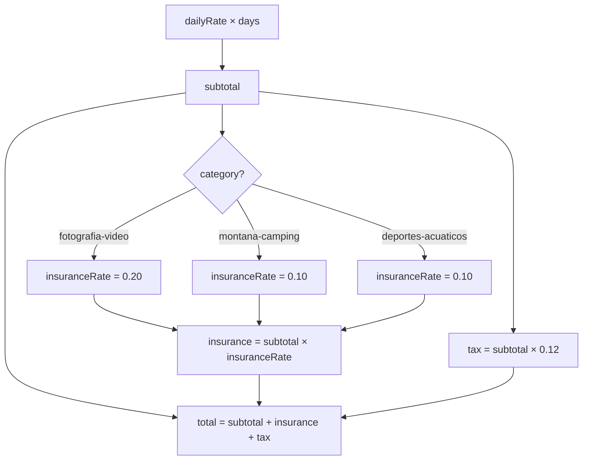

# Smart Insurance

Smart Insurance is automatically added to every rental. The rate depends on gear category.

## Rates

| Category | Rate |
|---|---|
| `fotografia-video` | 20% of subtotal |
| `montana-camping` | 10% of subtotal |
| `deportes-acuaticos` | 10% of subtotal |

Photography equipment carries a higher rate due to replacement cost and fragility.

## Calculation Flow



## Price Breakdown Example

For a 3-day photography rental at $850/day:

```
subtotal  = 850 × 3        = $2,550.00
insurance = 2550 × 0.20    =   $510.00  (20%)
tax       = 2550 × 0.12    =   $306.00  (12% IVA)
─────────────────────────────────────────
total                       = $3,366.00
```

## Implementation

**`src/lib/date-utils.ts`** — core calculation:

- `INSURANCE_RATES` — constant map of `Category → rate`
- `calculateInsuranceRate(category)` — returns rate for a category
- `calculatePrice(dailyRate, range, category)` — returns full `PriceBreakdown`

**`PriceBreakdown` interface:**

```typescript
interface PriceBreakdown {
  days: number;
  dailyRate: number;
  subtotal: number;
  insuranceRate: number;   // e.g. 0.20
  insurance: number;       // subtotal × insuranceRate
  tax: number;             // subtotal × 0.12
  total: number;           // subtotal + insurance + tax
}
```

## UI Display

Both `StepSummary` and `StepConfirmation` show the insurance line with the percentage label:

```
Seguro Smart (20%)    $510.00
IVA (12%)             $306.00
────────────────────────────
Total a pagar       $3,366.00
```
